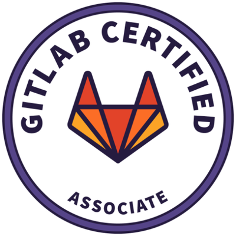
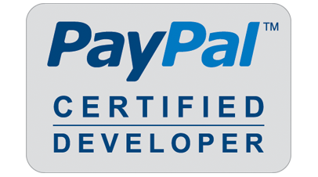
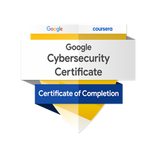
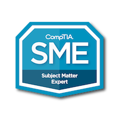
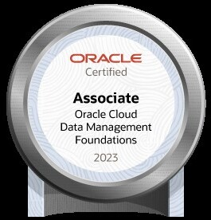
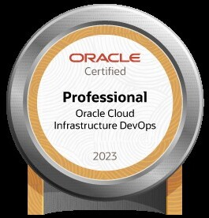

# About me
Hello there, I'm **Chooi Guan** (Yes, that's my first name).  This repo contains work and references that I've done through my career.  I have worked across various roles and domains throughout my life, and presently I work as a Cloud architect specialising in Cloud and DevOps.  I'm also very familiar on the business side of things, having run <a href="https://www.skyjuicesoftware.com" target="_blank">Skyjuice Software</a>.  As a teenager studying for my diploma, I wrote my first peice of software which I sold to a pharmeceutical company (Agouron Pharmaceuticals).  Before finishing my college degree, I was already writing and selling software to Fortune companies like Amazon, P&G, Boeing, Rockstar Games as well as many other companies and individuals with a customer base in the thousands.  I am an educator and contribute to the creation and evaluation of public technical certifications and content on platforms such as Coursera and professional certification authorities such as <a href="https://www.credly.com/badges/b0696bad-7654-4819-b291-b3ecf8c37447/public_url" target="_blank">CompTIA</a>.  I utilise my technical skills, ability to work with others and deliver quality software, to travel and live around the world.  As of this writing, I have lived and worked in some of the best and well known companies in the world in 5 countries over 3 continents for over 17 years.  One of my life goals is to live and work in North America.  I hold an accredited Executive MBA and also an <a href="https://www.dropbox.com/s/0u3qd88r9m3btff/options_advanced.pdf?dl=0" target="_blank">options trader</a> and have been trading professionally since 2019.  Personally I've traded other derivatives but options is my bread and butter.

❓ If you're interested in reading the story of Skyjuice Software, you can find out [here](http://bit.ly/soe2008).

🔎 Find me on [Linkedin](https://www.linkedin.com/in/cgl88/).

**TDLR; I can help you build the next Amazon.com**

## Education
* Executive MBA (Accredited), Quantic School of Business and Technology, Washington DC, USA, 2019
  * Specialisations: Strategic Thinking, Advanced Finance, Advanced Corporate-Level Strategy, Supply Chain and Operations
* Bachelors of Science (Honours 1) University Medallist Candidate (Top 1% of cohort), University of Queensland, Australia, 2006
  * Thesis: Adaptive Digital Narrative for Children
* Diploma in E-Business Application Development (Graduated top of cohort), Temasek Polytechnic, Singapore, 2003
* Diploma in Multimedia Software Engineering, Singapore Polytechnic, Singapore, 2000

## Awards
* [AWS re:Invent Hackathon for Good winner, 2019](https://aws.amazon.com/blogs/publicsector/reinvent-2019-nonprofit-hackathon-for-good-crowns-winner-to-support-mental-and-emotional-well-being-nonprofit/#:~:text=At%20the%20re%3AInvent%202019,Institute%2C%20and%20Vibrant%20Emotional%20Health.)
* Executive MBA scholarship, 2018 *($2800 USD value)*
* Apple WWDC scholarship, 2006 *($2500 USD value)*
* University of Queensland ITEE scholarship, 2004 *($50000 USD value)*

## Licenses and Certifications (Abridged)

| 🏆 | Certification | Issuer | Date |
| --- | --- | --- | --- |
|  | AWS Solutions Architect Associate | Amazon Web Services | 2018 |
|  | GitLab Associate | GitLab | 2020 |
|  | Devpost Profile | Devpost | N/A |
|  | HackerRank Profile | HackerRank | N/A |
|  | Pluralsight Profile | Pluralsight | N/A |
|  | PayPal Certified Developer | PayPal | 2008 |
|  | Google Cloud Skills Boost | Google | N/A |
|  | Google Cybersecurity Professional Certificate | Coursera | 2023 |
|  | 3x CompTIA Subject Matter Expert | CompTIA | 2022 |
|  | Oracle Cloud Data Management 2023 Certified Foundations Associate | Oracle | 2023 |
|  | Oracle Cloud Infrastructure 2023 Certified Foundations Associate | Oracle | 2023 |
|  | Oracle Cloud Infrastructure 2023 Certified DevOps Professional | Oracle | 2023 |
|  | Options Advanced | Options Industry Council | 2014 |

* See [here](https://www.dropbox.com/s/6dkoz9zes4s6llr/cv-certifications-2018.pdf?dl=0) for more

## Career
## 🇺🇸
**CompTIA (Remote, Part-time)**  
*April 2022 to Present*

I serve as a Subject Matter Expert (SME) for the Computing Technology Industry Association (CompTIA) where I work with an international team of SMEs in developing content of various certification exams with a focus on technologies, skills, and best practices used by industry professionals.

Areas of Technical Expertise
* Coding Foundations+
* Cloud+
* CloudNetX

CompTIA, based in Illinois, is an American non-profit trade association that issues professional certifications for the information technology (IT) industry. It is considered one of the IT industry's top trade associations and was established in 1982.  It issues vendor-neutral professional certifications in over 120 countries.  CompTIA subject matter experts are individuals who are deemed qualified to represent specific CompTIA certifications based on relevant and strong expertise, knowledge and experience in particular areas.

## 🇸🇪
**SEB**  
*April 2022 to Present*

Currently in the Security team, previously in the Platform Engineering team.

**Schibsted**  
*Oct 2021 to March 2022*

In the Cloud Governance team where I served as the AWS expert, providing best practise guidance on everything cloud.

**H&M**  
*Feb 2021 to Oct 2021*

In the AI Foundation team (Dev tools and infra) building a unified MLOps platform where teams can share their usecases and build ML models.  I built terraform modules and served as the IaC expert, evaluating every team's IaC maturity level in the AI foundation business unit (200+ people, 10+ teams).

**Sinch**  
*August 2020 to Feb 2021*

In the RTC operations team where I helped to improve/monitor their infrastructure on AWS.  Their platform enables billions of transactions a year.

## 🇦🇪
**Etisalat**  
*July 2019 to Sept 2019*

Served as AWS Architect working on the Expo 2020 project.

## 🇸🇪
**Scania**  
*Feb 2017 to June 2019*

Team Cloud Lead where I helped two teams (Driver Evaluation, Strategic Planning) with their cloud journey.

**Record Union**  
*May 2016 to Jan 2017*

A small startup where I worked as Senior Software Engineer and Scrum Master.

## 🇳🇴
**Cisco Systems**  
*Nov 2010 to Jan 2016*

Senior Software Engineer (Software Engineer III) where I worked in the TMSXE team and later, the Core TMS team.

## 🇦🇺

**Boeing**  
*Oct 2007 to Oct 2010*

Senior Software Engineer where I worked in the IPTIS (journey planning) team.

**The Bridge Volunteer Organisation**  
*Jan 2007 to Nov 2008* 

Executive Vice President for IT and Web, volunteer work.

**Ericsson**  
*Oct 2006 to Nov 2006*

IT Consultant where I created macros generating Excel reports in VBA for the team for a HSDPA bidding project in the Brisbane office.

**University of Queensland**  
*July 2005 to June 2006*

Held four roles where I was:
- University Tutor for Project Management
- University Tutor for Web Scripting
- University Tutor for Robocup Jr 
- Research Assistant for Psychology

## 🇸🇬
**Skyjuice Software**  
*Feb 2004 to Sept 2007*

Founder of Skyjuice Software which was formally registered as a business in 2004.
