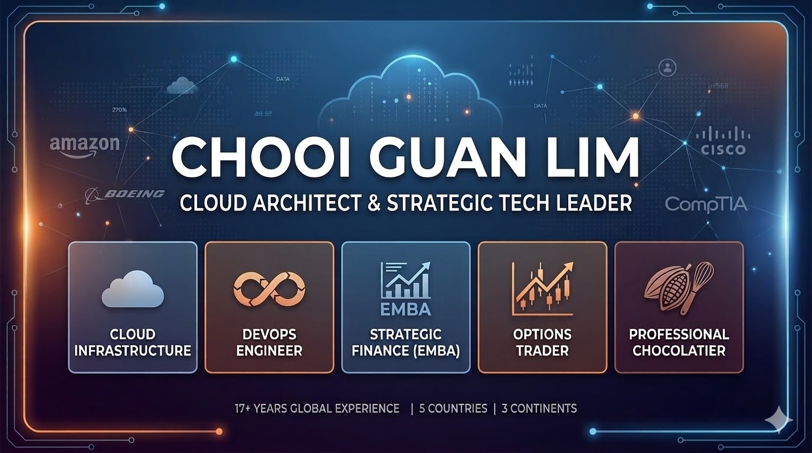

# 🚀 Chooi Guan | Cloud Architect & Strategic Tech Leader

**Cloud Infrastructure | DevOps | Strategic Finance (EMBA) | Options Trader | Chocolatier**

I am a veteran technologist with over 17 years of experience spanning 5 countries and 3 continents. My career began with a high-impact start—selling proprietary software to **Agouron Pharmaceuticals** as a teenager and later to **Amazon, Boeing, and P&G** before completing my degree.

Today, I bridge the gap between high-level business strategy and deep technical execution. Whether I'm designing global-scale cloud governance or advising **CompTIA** on the future of technical certifications, my focus is: **Building resilient, scalable systems that drive bottom-line value.**

---

### 🛠️ Key Expertise
* **Cloud Architecture:** Google Professional Cloud Architect, AWS Solutions Architect, OCI DevOps Professional.
* **Strategic Leadership:** Accredited Executive MBA (Finance & Strategy).
* **Cybersecurity:** 8 CompTIA Certifications and more (including CySA+, PenTest+, CloudNetX).
* **Entrepreneurship:** Founder of Skyjuice Software; Professional Options Trader since 2019.

---

## 📈 Professional Journey (Chronological)

### 🇺🇸 United States
**CompTIA | CompTIA SME Technical Advisory Committee (CSTAC)** *April 2022 – Present*
* Member of the elite **CompTIA SME Technical Advisory Committee (CSTAC)**. Developing global standards and high-stakes content for **CloudNetX**, **Cloud+**, and **AutoOps+** exams.

### 🇸🇪 Sweden
**SEB | Lead & Senior Platform Engineer** *April 2022 – November 2024*
* Led security and platform initiatives for one of the Nordics' largest financial institutions, providing mentorship and architectural guidance for mission-critical banking infrastructure.

**Schibsted | AWS Expert (Cloud Governance)** *October 2021 – March 2022*
* Served as the AWS Subject Matter Expert, providing best practice guidance and cloud governance for a multi-account ecosystem.

**H&M | IaC Expert (AI Foundation)** *February 2021 – October 2021*
* Engineered a unified MLOps platform for a 200+ person business unit. Evaluated IaC maturity and built Terraform modules to scale ML model deployments.

**Sinch | Cloud Infrastructure Engineer (RTC Operations)** *August 2020 – February 2021*
* Optimized and monitored AWS infrastructure for a global platform enabling billions of transactions.

### 🇦🇪 United Arab Emirates
**Etisalat | AWS Architect (Expo 2020)** *July 2019 – September 2019*
* Cloud Architect for the high-profile **Expo 2020** project, designing scalable AWS solutions for international-scale traffic.

### 🇸🇪 Sweden (Early Phase)
**Scania | Team Cloud Lead** *February 2017 – June 2019*
* Orchestrated the cloud journey for the Driver Evaluation and Strategic Planning divisions, leading the transition to cloud-native architectures.

**Record Union | Senior Software Engineer & Scrum Master** *May 2016 – January 2017*
* Facilitated agile delivery and technical execution for a growing music-tech startup.

### 🇳🇴 Norway
**Cisco Systems | Senior Software Engineer (III)** *November 2010 – January 2016*
* Core engineer for the TMS and TMSXE teams, managing enterprise-grade video communication infrastructure.

### 🇦🇺 Australia
**Boeing | Senior Software Engineer** *October 2007 – October 2010*
* Developed mission-critical journey planning software within the IPTIS team.

**The Bridge Volunteer Org | Executive VP for IT** *2007 – 2008*

**Ericsson | IT Consultant** *2006*

### 🇸🇬 Singapore
**Skyjuice Software | Founder** *February 2004 – September 2007*
* Successfully built and sold software to Fortune 500 companies (Amazon, Boeing, P&G) while still a student.

---

## 🎓 Education & Honors

* **Professional Chocolatier** | Bells Institute, Singapore (2025) 🍫
* **Executive MBA (Accredited)** | Quantic School of Business & Technology, Washington DC (2019)
* **B.Sc. (Hons 1) University Medallist Candidate** | University of Queensland, Australia (2006)
* **Diplomas in E-Business & Multimedia Software Engineering** | Temasek & Singapore Polytechnic.

### 🏆 Major Awards
* **AWS re:Invent Hackathon Winner (2019)**
* **HackerRank Silver Medallist (Top 5% globally, 2016)**
* **Apple WWDC Scholar (2006)**
* **Spirit of Enterprise National Award Nominee (2008)**

---

## 📜 Certifications (Selected)

| | Credential | Issuer | Year |
| :--- | :--- | :--- | :--- |
| ☁️ | **Professional Cloud Architect** | Google Cloud | 2024 |
| 🛡️ | **CompTIA CySA+ / PenTest+ / CloudNetX** | CompTIA | 2025 |
| 🛡️ | **CompTIA Security+ / Cloud Essentials** | CompTIA | 2024 |
| 🏗️ | **Solutions Architect Associate** | AWS | 2018 |
| 🚀 | **OCI Certified DevOps Professional** | Oracle | 2023 |

*...and many more technical certifications.*

---

## 🤝 Let's Connect
* 💼 **LinkedIn:** [linkedin.com/in/cgl88/](https://www.linkedin.com/in/cgl88/)
* 📖 **The Skyjuice Software Story:** [Read the entrepreneurial journey here](http://bit.ly/soe2008)

**TL;DR: I can help you build the next Amazon.com.**